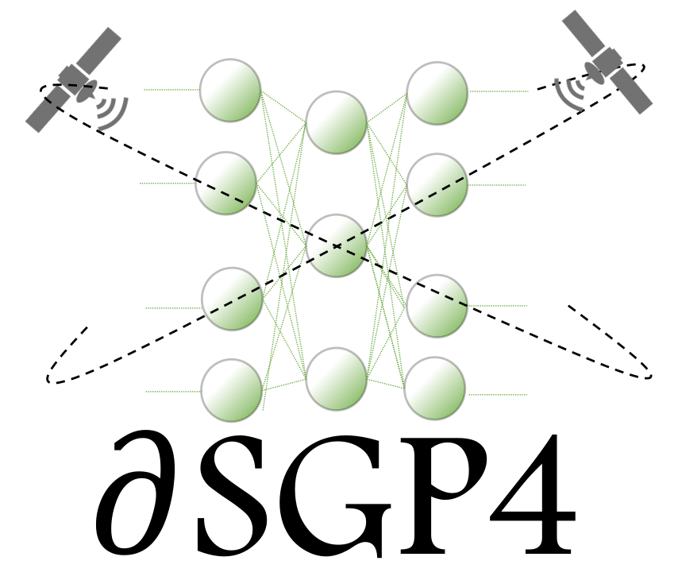

# $\partial\textrm{SGP4}$
[](https://github.com/esa/dSGP4/actions/workflows/build.yml)
[](https://codecov.io/gh/esa/dSGP4)
[](https://anaconda.org/conda-forge/dsgp4)
[](https://anaconda.org/conda-forge/dsgp4)

Differentiable SGP4.
<!-- PROJECT LOGO -->
<br />
<p align="center">
  <a href="https://github.com/esa/dSGP4">
    
  </a>
  <p align="center">
    Differentiable SGP4
    <br />
    <a href="https://esa.github.io/dSGP4"><strong>Explore the docs »</strong></a>
    <br />
    <br />
    <a href="https://github.com/esa/dSGP4/issues/new/choose">Report bug</a>
    ·
    <a href="https://github.com/esa/dSGP4/issues/new/choose">Request feature</a>
  </p>
</p>

## Info


This repository contains the code discussed in [this paper](https://doi.org/10.1016/j.actaastro.2024.10.063). 

$\partial \textrm{SGP4}$ is a differentiable version of SGP4 implemented using PyTorch. By making SGP4 differentiable, $\partial \textrm{SGP4}$ facilitates various space-related applications, including spacecraft orbit determination, covariance transformation, state transition matrix computation, and covariance propagation. 
Additionally, $\partial \textrm{SGP4}$'s PyTorch implementation allows for parallel orbital propagation across batches of Two-Line Element Sets (TLEs), leveraging the computational power of CPUs, GPUs, and advanced hardware for distributed prediction of satellite positions at future times. Furthermore, $\partial \textrm{SGP4}$'s differentiability enables integration with modern machine learning techniques. 
Thus, we propose a novel orbital propagation paradigm, $\textrm{ML}-\partial \textrm{SGP4}$, where neural networks are integrated into the orbital propagator. 
Through stochastic gradient descent, this combined model's inputs, outputs, and parameters can be iteratively refined, surpassing SGP4's precision while maintaining computational speed. This empowers satellite operators and researchers to train the model using high-precision simulated or observed data, advancing orbital prediction capabilities compared to the standard SGP4.

## Goals

* Differentiable version of SGP4 (implemented in PyTorch)
* Hybrid SGP4 and machine learning propagation: input/output/parameters corrections of SGP4 from accurate simulated or observed data are learned
* Parallel TLE propagation
* Use of differentiable SGP4 on several spaceflight mechanics problems (state transition matrix computation, covariance transformation, and propagation, orbit determination, ML hybrid orbit propagation, etc.)

## How to cite

If you use `dsgp4`, we would be grateful if you could star the repository and/or cite our work.
$\partial \textrm{SGP4}$ and its applications for ML hybrid propagation and more, can be found in our [publication](https://doi.org/10.1016/j.actaastro.2024.10.063):

```bibtex
@article{acciarini2024closing,
title = {Closing the gap between SGP4 and high-precision propagation via differentiable programming},
journal = {Acta Astronautica},
volume = {226},
pages = {694-701},
year = {2025},
issn = {0094-5765},
doi = {https://doi.org/10.1016/j.actaastro.2024.10.063},
url = {https://www.sciencedirect.com/science/article/pii/S0094576524006374},
author = {Giacomo Acciarini and Atılım Güneş Baydin and Dario Izzo},
keywords = {SGP4, Orbital propagation, Differentiable programming, Machine learning, Spacecraft collision avoidance, Kessler, Kessler syndrome, AI for space, Applied machine learning for space},
}
```

## Installation

Via [pip](https://pypi.org/project/dsgp4/):
```
pip install dsgp4
```

Via [conda](https://anaconda.org/conda-forge/dsgp4):
```
conda install conda-forge::dsgp4
```

or mamba:
```
mamba install dsgp4
```

Local installation:
```
git clone https://github.com/esa/dSGP4.git
cd dSGP4
pip install -e .
```

## Documentation and examples

To get started, follow the examples in the [documentation](https://esa.github.io/dSGP4/). You will find tutorials with basic and more advanced functionalities and applications. 

## Authors:
* [Giacomo Acciarini](https://www.esa.int/gsp/ACT/team/giacomo_acciarini/)
* [Atılım Güneş Baydin](http://gbaydin.github.io/)
* [Dario Izzo](https://www.esa.int/gsp/ACT/team/dario_izzo/)

The project originated after the work of the authors at the [University of Oxford AI4Science Lab](https://oxai4science.github.io/).

## Acknowledgements:

We would like to thank Dr. T.S. Kelso for his support and useful pointers on how to correctly validate the code with respect to the [official release](https://www.space-track.org/documentation#/sgp4) by Space-Track.

## License:

$\partial\textrm{SGP4}$ is distributed under the GNU General Public License version 3. Get in touch with the authors for other licensing options.

## Contact:
* `giacomo.acciarini@gmail.com`
