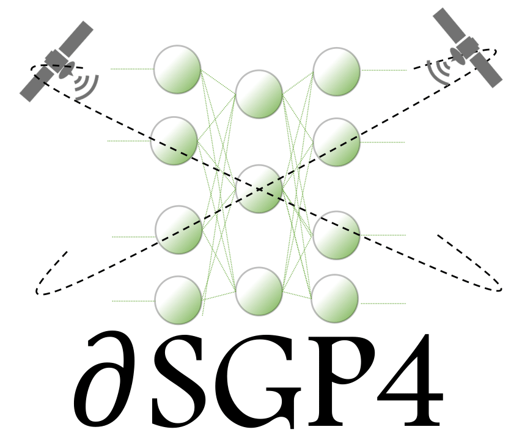

# dSGP4 ($\partial\textrm{SGP4}$)
[](https://github.com/esa/dSGP4/actions/workflows/build.yml)
[](https://codecov.io/gh/esa/dSGP4)
[](https://anaconda.org/conda-forge/dsgp4)
[](https://anaconda.org/conda-forge/dsgp4)

Differentiable SGP4 in PyTorch.

<p align="center">
  <a href="https://github.com/esa/dSGP4">
    
  </a>
</p>

This repository contains the implementation described in:

Acciarini, Baydin, Izzo, *Closing the gap between SGP4 and high-precision propagation via differentiable programming*, Acta Astronautica (2025), [https://doi.org/10.1016/j.actaastro.2024.10.063](https://doi.org/10.1016/j.actaastro.2024.10.063).

## What dSGP4 provides

- A PyTorch implementation of SGP4 with autograd support.
- Gradients of propagated states with respect to time and TLE-derived parameters.
- Single-object and batched propagation APIs.
- A hybrid model (`mldsgp4`) for learning corrections around SGP4 dynamics.

Primary use cases include state transition matrix estimation, covariance transformation/propagation, gradient-based orbit estimation, and ML-augmented orbit prediction.

## Installation

From PyPI:

```bash
pip install dsgp4
```

From conda-forge:

```bash
conda install conda-forge::dsgp4
# or
mamba install dsgp4
```

From source:

```bash
git clone https://github.com/esa/dSGP4.git
cd dSGP4
pip install -e .
```

## Quick start

### 1. Parse a TLE and propagate

```python
import torch
import dsgp4

tle = dsgp4.TLE([
    "1 25544U 98067A   24060.50000000  .00016717  00000-0  30134-3 0  9990",
    "2 25544  51.6403 124.7938 0005102 220.2782 248.4427 15.50010353440289",
])

# Initialize once, then reuse for multiple propagations.
dsgp4.initialize_tle(tle, gravity_constant_name="wgs-84")

# tsince is in minutes from TLE epoch.
tsince = torch.tensor([0.0, 10.0, 20.0])
state = dsgp4.propagate(tle, tsince)

# state shape: (N, 2, 3) when tsince has N elements
# state[:, 0, :] -> position [km], state[:, 1, :] -> velocity [km/s]
print(state.shape)
```

### 2. Differentiate through propagation

```python
import torch
import dsgp4

tle = dsgp4.TLE([
    "1 25544U 98067A   24060.50000000  .00016717  00000-0  30134-3 0  9990",
    "2 25544  51.6403 124.7938 0005102 220.2782 248.4427 15.50010353440289",
])

time_min = torch.tensor(15.0, requires_grad=True)
state = dsgp4.propagate(tle, time_min, initialized=False)

# Example scalar objective: x-position at time_min.
loss = state[0, 0]
loss.backward()
print(time_min.grad)
```

### 3. Batched propagation

```python
import torch
import dsgp4

tles = [
    dsgp4.TLE([
        "1 25544U 98067A   24060.50000000  .00016717  00000-0  30134-3 0  9990",
        "2 25544  51.6403 124.7938 0005102 220.2782 248.4427 15.50010353440289",
    ]),
    dsgp4.TLE([
        "1 40967U 15058A   24060.50000000  .00000033  00000-0  00000+0 0  9992",
        "2 40967   0.0187  89.2881 0002035  82.1068 220.3980  1.00270014 30754",
    ]),
]

times = torch.tensor([5.0, 30.0])
states = dsgp4.propagate_batch(tles, times, initialized=False)
print(states.shape)  # (2, 2, 3)
```

## Technical notes and limitations

- Time input (`tsince`) is in minutes from the TLE epoch.
- Output units are km (position) and km/s (velocity).
- Supported gravity constants: `wgs-72`, `wgs-84`, `wgs-72old`.
- Deep-space propagation is currently not supported (periods above 225 minutes).
- Default torch dtype is set to `float64` when importing `dsgp4`.

## Development

Run tests:

```bash
pytest -q
```

## Documentation and notebooks

- Full docs: [https://esa.github.io/dSGP4](https://esa.github.io/dSGP4)
- Tutorials and examples are in `doc/notebooks/`.

## Citation

If you use `dsgp4`, please cite:

```bibtex
@article{acciarini2024closing,
  title = {Closing the gap between SGP4 and high-precision propagation via differentiable programming},
  journal = {Acta Astronautica},
  volume = {226},
  pages = {694-701},
  year = {2025},
  issn = {0094-5765},
  doi = {https://doi.org/10.1016/j.actaastro.2024.10.063},
  url = {https://www.sciencedirect.com/science/article/pii/S0094576524006374},
  author = {Giacomo Acciarini and Atılım Güneş Baydin and Dario Izzo},
  keywords = {SGP4, Orbital propagation, Differentiable programming, Machine learning, Spacecraft collision avoidance, Kessler, Kessler syndrome, AI for space, Applied machine learning for space}
}
```

## Authors

- [Giacomo Acciarini](https://www.esa.int/gsp/ACT/team/giacomo_acciarini/)
- [Atılım Güneş Baydin](http://gbaydin.github.io/)
- [Dario Izzo](https://www.esa.int/gsp/ACT/team/dario_izzo/)

The project originated from work at the [University of Oxford AI4Science Lab](https://oxai4science.github.io/).

## Acknowledgements

We thank Dr. T.S. Kelso for support and validation guidance against the official Space-Track SGP4 release:
[https://www.space-track.org/documentation#/sgp4](https://www.space-track.org/documentation#/sgp4).

## License

dSGP4 is distributed under GNU GPL v3. Contact the authors for alternative licensing options.

## Contact

- giacomo.acciarini@gmail.com
